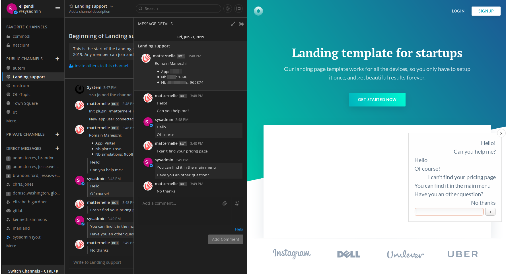

# Matternelle

Transform your mattermost instance to a full featured chat on any WebApp.

Forked from: https://gitlab.com/itk.fr/matternelle/

> The plugin is currently in alpha! Use it with caution!



## Features

* **Manage your web** apps in one or multiple channels
* **One thread** by user on web app
* **Share responses** to all colaborators in your team
* **Off** if nobody can respond to users

## Installation

1. Install the plugin
    1. This fork doesn't have releases yet. The plugin can be built and bundled by running `make dist`. The g-zipped bundle will be saved in the `dist` folder.
    2. In Mattermost, go the System Console -> Plugins -> Management
    3. Upload the plugin bundle built in step 1. The g-zipped bundle can be found in the `dist` folder.
    4. Enable the plugin and modify the configration as needed
2. Install the webcomponent
    1. Build the webcomponent by running `npm run build` in the `webcomponent` folder. This will create a `matternelle.js` file in the `webcomponent/dist` folder.
    2. see usage section to use it

## Usage

* Go to a mattermost channel and enter `/matternelle init appName` it will give you a unique token
* In any webapp add:

```html
<head>
    <!-- Load polyfills if needed -->
    <script src="./webcomponents-loader.js" defer></script> 

    <!-- Load components via WebComponents.waitFor -->
    <script type="module">
        window.WebComponents = window.WebComponents || { 
            waitFor(cb){ addEventListener('WebComponentsReady', cb) }
        } 
        WebComponents.waitFor(async () => { 
            import('./matternelle.js');
        });
    </script>
</head>
<body>
    <matternelle-element id="matternelle" token="Previous token generated (XXX-YYYY-MMMM-ZZ)" url="Mattermost url without protocol but with websocket port (127.0.0.1:8989)"></matternelle-element>
    <script>
        function fireOnReady() { 
            document.querySelector('#matternelle').user = `Matternelle user`;
        }
        if (document.readyState === 'complete') {
            fireOnReady();
        } else {
            document.addEventListener("DOMContentLoaded", fireOnReady);
        }
    </script>
</body>
```
* See the `index.html` file in the `webcomponent` folder for an example.
* Every time a user will ask for help, it will build a new thread in your mattermost channel
* Every time someone respond to this thread, user will be notified in app

## Developing

This plugin contains both a server and web app portion.

Use `make dist` to build distributions of the plugin that you can upload to a Mattermost server.

Use `make check-style` to check the style.

Use `make deploy` to deploy the plugin to your local server. Before running make deploy you need to set a few environment variables:

export MM_SERVICESETTINGS_SITEURL=http://localhost:8065
export MM_ADMIN_USERNAME=admin
export MM_ADMIN_PASSWORD=password

### Full 1 line development

```sh
make deploy && cd webcomponent/ && npm start
```

## Feedback and Feature Requests

Feel free to create a [Github issue](https://github.com/ashishbhate/matternelle/issues).
